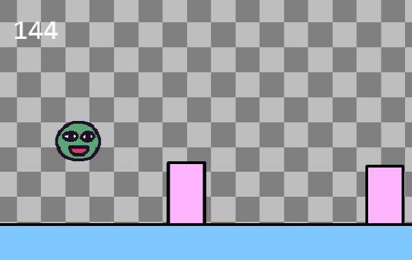

Welcome! Kaboom is a JavaScript library that helps you make games fast and fun :D

This is an intro tutorial that will cover the basic concepts and make a very simple [Chrome Dino](https://en.wikipedia.org/wiki/Dinosaur_Game) - ish game.

simple game using Kaboom
